# Package de personnalisation de la vue Primo de l'Université Bordeaux Montaigne (33PUDB_UBM:NDE)

## Prérequis et utilisation de l'interface de développement
[Voir la documentation d'Ex Libris](DEPLOYMENT.md)

## Liste des personnalisations Angular

### UbmBriefDisplay

Module de personnalisation de l'affichage des notices (affichage abrégé / Brief Display) dans la liste des résultats.

#### 1. Affichage des 2ᵉ & 3ᵉ lignes dans le Brief Display pour les résultats provenant de CDI

Afin de personnaliser et d'améliorer l'affichage des résultats locaux selon le type de document, l'alimentation des 2ᵉ et 3ᵉ lignes du Brief Display s'appuie sur des champs locaux :
- **2ᵉ ligne** : Auteurs construits à partir des champs `200$f` et `$g` de la notice pour une meilleure lisibilité et pour empêcher une surcharge d'information en cas d'auteurs multiples.
- **3ᵉ ligne** : Affiche la zone `328` pour les travaux universitaires, ou les coordonnées pour les cartes géographiques.

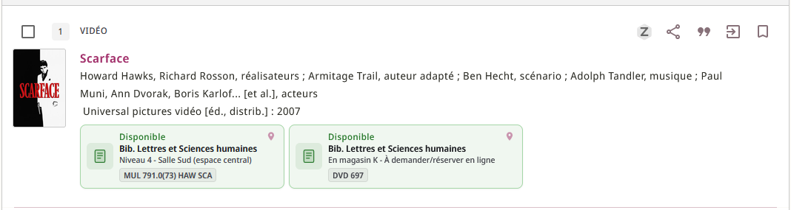
Les champs par défaut **Auteurs** (`creator`) et **Éditeur** (`publisher`) ne sont plus remontés nativement pour CDI. Ce module extrait directement les données depuis les champs PNX locaux pour garantir un affichage fluide et coherent.

#### 2. Badge « Publication / contribution d'un membre de l'Université Bordeaux Montaigne »

Un badge distinctif est affiché dans la liste des résultats pour identifier les publications issues de l'université.
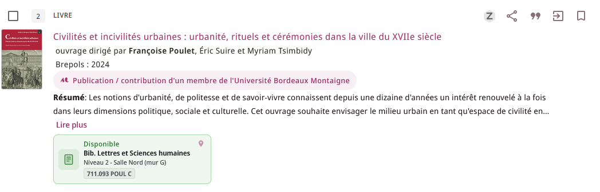
- **Condition d'affichage** : Présence du champ PNX `lds30` contenant la valeur exacte `publicationUBM`.
- **Source des données** : Ce champ PNX est généré automatiquement lors de l'indexation lorsqu'un champ `970 $a` est présent dans la notice bibliographique MARC21 ou UNIMARC.
- **Procédure de catalogage** : Ajout en masse. Se référer à la procédure interne de traitement des notices pour les consignes d'ajout du champ `970`.
- **Code du libellé** (Table *NDE Custom Defined Labels*) : `ubmbriefdisplay.publicationUBM`
  
---

### UbmChangePasswordMessage

Injecte un message dans le compte lecteur, sous le lien de modification du mot de passe, pour informer que le service est limité aux lecteurs extérieurs.
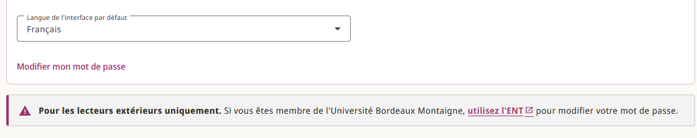
* **Codes libellés utilisés** (Table *NDE Custom Defined Labels*) : `ubmchangepassword.#####`

---

### UbmCustomAvailability

Surcharge l'affichage de la disponibilité dans le Brief Display.

#### Au niveau de la liste des résultats

Affiche la disponibilité pour toutes les localisations de l'institution sous forme d'infocarte.
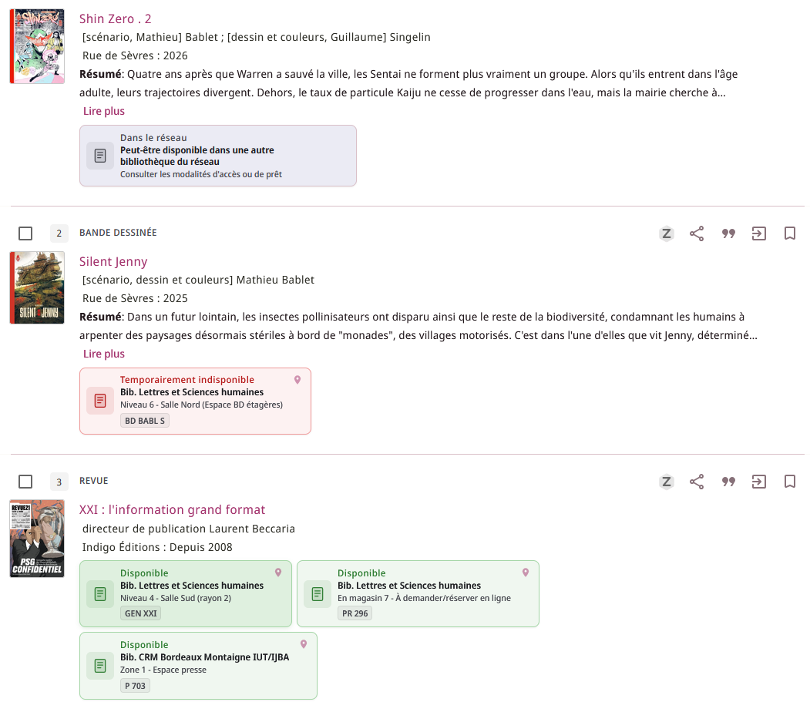

#### Au niveau de l'affichage détaillé

Affiche un message pour inciter l'usager à se connecter afin de :

* Demander les documents qui se trouvent en magasin. *(TODO: Déplacer le message au niveau de la holding)*
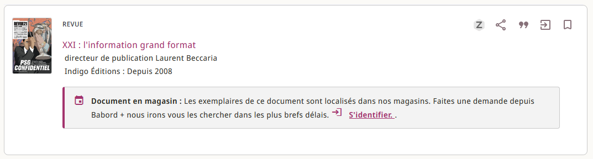
* Réserver un document emprunté.*(]TODO: Déplacer le message au niveau de la holding)*
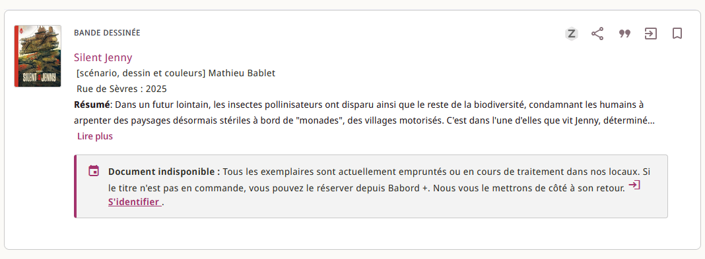
* Voir la disponibilité dans un autre établissement du réseau.
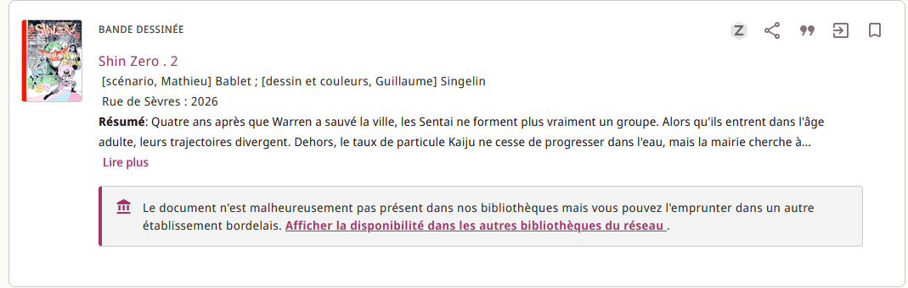
* Pour les documents de la réserve, invite l'usager à contacter le service des collections patrimoniales. *(TODO: Déplacer le message au niveau de la holding)*
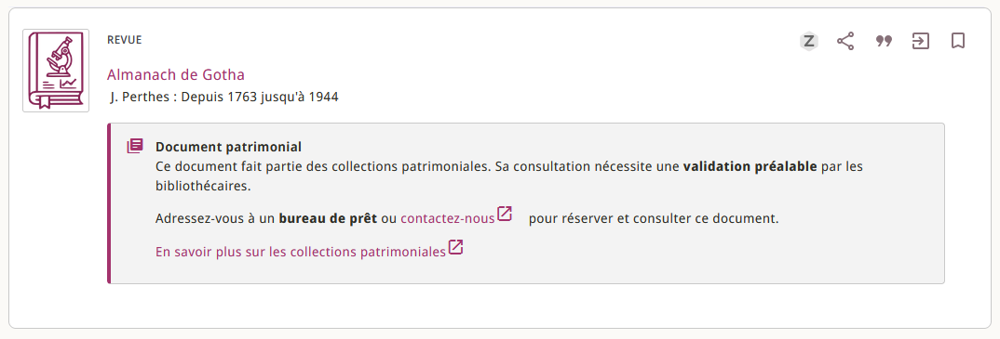

---

### UbmCustomResultListAfterComponent

Affiche un message sous la liste des résultats permettant de relancer la recherche sur :

* Le catalogue de Bordeaux Métropole
* Le SUDOC
* Google Scholar
* OpenAlex
* WorldCat

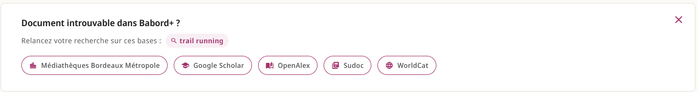

*(TODO: Revoir l'internationalisation pour utiliser les tables de codes Alma)*

---

### UBMRecordActions

Ajoute un service d'export de la notice vers ZoteroBib.
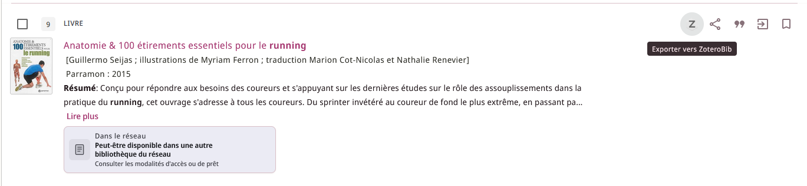

---

### UbmHelpOverlay

Crée une page d'aide sous la forme d'un *Overlay* accessible à tout moment de la navigation.
*(TODO: Résoudre les problèmes de traduction dans la section « Trucs et astuces »)*

---

### UbmHomePageActu

Gère l'affichage de la page d'accueil.
Le message de la section **Messages** peut être alimenté depuis la table *NDE Custom Defined Labels* :

* **Titre** : `homepage.annonce.titre`
* **Message** : `homepage.annonce.message`
* **Texte du bouton** : `homepage.annonce.bouton`
* **Lien** : `homepage.annonce.lien`

---

### UbmItemHook

Refonte de l'affichage des exemplaires :

* Affichage de toutes les informations utiles sur une seule ligne (empêche le dépilement). Informations retenues :
* Disponibilité
* Règle de circulation
* Description
* Cote exemplaire
* Note publique

> [!IMPORTANT]
> Nécessite d'empêcher le dépilement de la pile exemplaire (cf. [`custom.css`](./src/assets/css/custom.css) *"Liste des exemplaires"*).

* Calcul générique de la règle de circulation (Empruntable ou autre statut spécifique) sans que l'usager soit authentifié. À l'authentification, le système affiche la règle calculée.

> [!IMPORTANT]
> Nécessite d'appliquer des exceptions de circulation à tous les exemplaires situés dans des localisations ayant des règles spécifiques (Consultation sur place, Prêt limité. Voir les traitements planifiés *"Change Physical items information - Exceptions de circulation pour Babord +"*).

* Si le document est localisé en magasin, affiche un lien vers le formulaire d'authentification.

#### UbmLoginFromHook

Permet de rediriger les utilisateurs appartenant à un autre établissement du réseau vers le catalogue de leur institution. Redirige l'utilisateur vers le formulaire d'authentification. Une fois authentifié sur le catalogue de son université, il est redirigé vers la page en cours de consultation (sauf en cas d'affichage d'une notice détaillée, car les identifiants ne sont pas les mêmes).

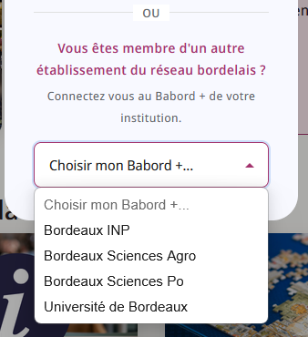
---

### UbmRebondFullDisplay

Crée une section **« Rechercher le document dans une autre bibliothèque »** au niveau de l'affichage détaillé. Permet à l'usager de rechercher le document dans le SUDOC ou dans le catalogue des bibliothèques de Bordeaux Métropole.

* **SUDOC** : La requête est construite en priorité sur le PPN, sinon l'ISBN ou l'ISSN, et enfin une clé Auteur/Titre.
* **Bordeaux Métropole** : Seule la recherche Auteur/Titre est prise en charge.

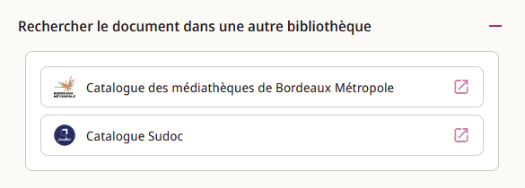
---

### UbmRequestCardHook

Lorsqu'une notice de numéro isolé est affichée et que le lien est fait au niveau de la notice (lien au PPN) au lieu de l'exemplaire, il est compliqué pour l'utilisateur de retrouver le fascicule qui l'intéresse.

Ce composant extrait les informations du champ `pnx.display.relation`. Il identifie les relations mises en place via le champ `461` (via le subfield code du libellé en `$$C`) et affiche une note au-dessus de la *holding* du titre lié pour rappeler les informations nécessaires pour repérer le fascicule correspondant à la notice affichée.

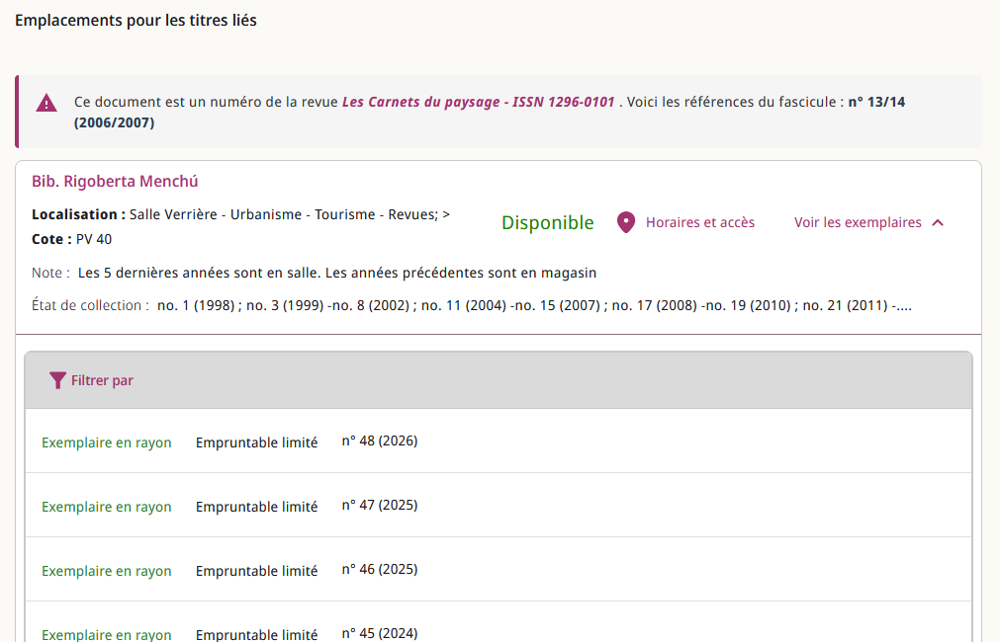

[Exemple de notice concernée](https://babordplus.u-bordeaux-montaigne.fr/nde/fulldisplay?query=113562020&tab=Everything&search_scope=DN_and_CI&lang=fr&vid=33PUDB_UBM:NDE&docid=alma991004285439704674&adaptor=Local%20Search%20Engine&context=L&isFrbr=false&isHighlightedRecord=false&state=)

---

### UbmResourceTypeBarHook

Lorsqu'un préfiltre "Type de document" est utilisé, la barre d'état des filtres ne rappelle pas qu'un filtre de ce type a été appliqué à la requête. Ce composant invisible intercepte les clics sur la barre `nde-search-results-resource-type-bar` pour simuler l'utilisation d'une facette standard.

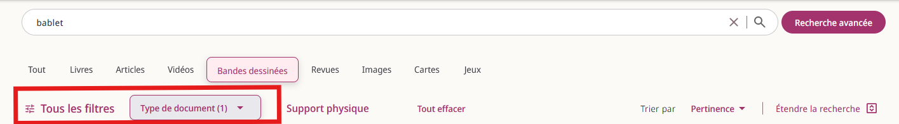
